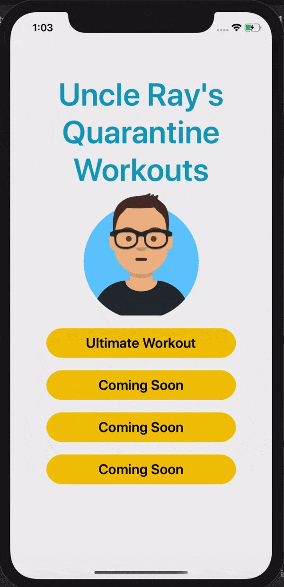
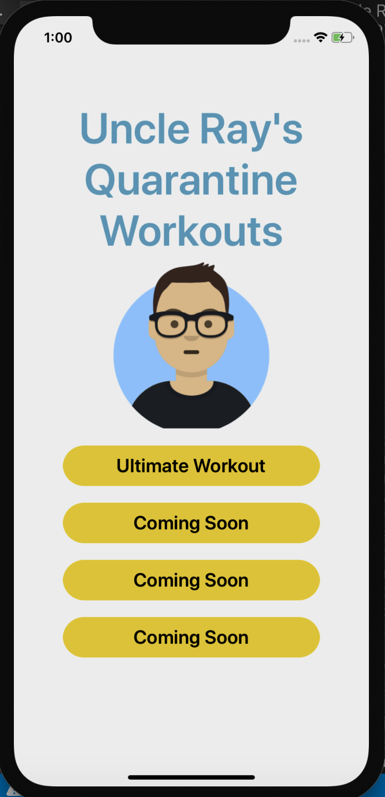
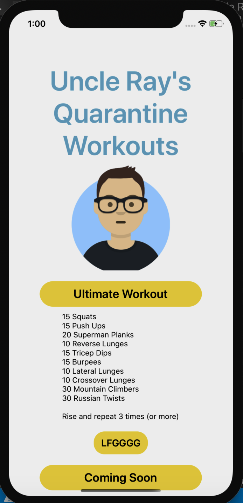

# Uncle Ray's Quarantine Workouts

An iOS mobile workout application for Vancouver-based ultimate frisbee club teams, [Mola Mola](https://www.facebook.com/molamolaultimate/) and [Fable](https://www.facebook.com/fableultimate). Built with [React-Native](https://reactnative.dev/docs/getting-started) and [React-Navigation](https://reactnavigation.org/). This app also uses [React Countdown Component](https://www.npmjs.com/package/react-native-countdown-component).

All workouts are the intellectual property of Raymond Young, who is silent and deadly on the field, but kind and gentle in all other aspects of life.

This developer does not own the copyright to any of the GIFs in this application. They're taken from 7 Daily Workouts (which doesn't seem to exist anymore) and other corners of the internet where we all live. Please don't sue me. I don't have any money.

---

## App Demo

---

## App Images

---

## Installation Instructions

Use the commands below to run _Uncle Ray's Ultimate Workouts_ in in your local environment:

### Installation

### Install dependencies:

`yarn install`

### Install pods for IOS:

`cd ios && pod install`

### Run iOS

In project root directory:

`react-native run-ios`

or

`yarn run ios`

---

## Technologies Used

### React-Native

### React Navigation

### React Countdown Component

---

## About the Developer

Hi there! Thanks for making it all the way to the bottom - do people actually read the README?

My name is Brooke, I'm a Vancouver-based developer and ultimate frisbee aficionado. I don't have much to say about myself, other than that I'm open to opportunities and collaborations!

If you're here, you've already found my GitHub. Find me on [LinkedIn](https://www.linkedin.com/in/brooke-xiang/) too!
